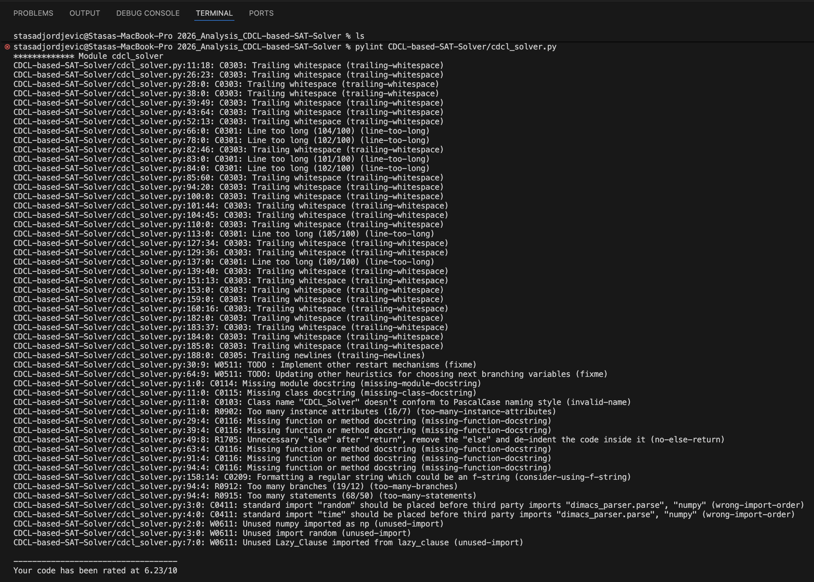

# Analiza CDCL-based SAT Solver-a

Sprovodi se analiza projekta koji je napisan u Python-u za rešavanje SAT problema koristeći CDCL algoritam.

Napomena: fajlovi iz originalnog projekta `dpll_solver.py` i `cnf_data_structure.py` se nigde ne koriste - trebalo bi biti obrisani. `dpll_solver.py` ima smisla jer prikazuje jednostavniji ali manje efikasan DPLL algoritam. Fajl `cnf_data_structure.py` je skroz nepotreban (dupliran kod).

Primenjeni su sledeći alati za analizu projekta:
...

## Integraciono testiranje

Za proveru ispravnosti solver-a sprovedeno je integraciono testiranje.  
Testovi su smešteni u folderu `tests/integration` i sadrže formule u DIMACS CNF formatu.  
Svaki test proverava da li je data formula zadovoljiva (SAT) ili nezadovoljiva (UNSAT).  

Test primeri u folderu `/all_sat` preuzeti su sa sajta:  
https://www.cs.ubc.ca/~hoos/SATLIB/benchm.html

Integracionim testovima pokriveni su sledeći slučajevi:
TODO DODATI JOS TESTOVA
- Obične zadovoljive formule (SAT)
- Obične nezadovoljive formule (UNSAT)
- Specijalni slučajevi:
  - Prazna formula
  - Prazna klauza
  - Formule sa jednom promenljivom

Pokretanje integracionih testova vrši se pomoću skripte `test_integration.py`, koja prolazi kroz sve test fajlove i pokreće solver nad njima.

### Pokretanje testova

Testovi se pokreću naredbom:

```bash
pytest tests/integration
```
### Izlaz testova

Nakon pokretanja testova, `pytest` prikazuje rezultate izvršavanja, uključujući:

- broj uspešno izvršenih testova,
- eventualne greške,
- vreme izvršavanja.

Ovaj pristup omogućava jednostavnu reprodukciju testova i proveru funkcionalnosti kompletnog sistema.

## Jedinično testiranje

Jedinično testiranje ima za cilj proveru ispravnosti pojedinačnih komponenti rešavača izolovano od ostatka sistema.  
Ovaj tip testiranja omogućava rano otkrivanje grešaka i olakšava održavanje i dalji razvoj koda.

Testovi su smešteni u folderu `tests/unit` i organizovani po klasama koje testiraju.

### Pokrivene komponente

#### Klasa `Clause`

Klasa `Clause` predstavlja jednu logičku klauzu u CNF formuli i sadrži najkritičniju logiku za rad solvera. Testovima su pokriveni sledeći aspekti:

- Inicijalizacija klauze i otkrivanje tautologija u fazi preprocesiranja (`preprocess`)
- Provera stanja klauze — da li je jedinična (`is_unit`) ili prazna (`is_empty`)
- Boolean Constraint Propagation (`bcp`) — zadovoljavanje i falsifikovanje literala,
  kao i detekcija konflikta kada klauza ostane bez aktivnih literala
- Vraćanje klauze na prethodno stanje tokom backtrackinga (`restore`)
- TODO dodati jos ?

Tokom testiranja uočena je jedna nepravilnost - prilikom preprocesiranja, ukoliko je u pitanju tautologična klauza, vrednost se postavljana 1 (tačno) i veličina na 0. Međutim, u konstruktoru se veličina postavlja na dužinu niza klauze nakon poziva funkcije preprocess, i time se "obriše" to što je prilikom preprocesiranja postavljena na 0.

### Klasa `Implication_Graph`
Klasa `Implication_Graph` predstavlja graf implikacija koji se gradi tokom pretrage i koristi se za analizu konflikata i backtracking u CDCL algoritmu. Za svaki dodeljeni literal pamti se antecedent (klauza koja je uzrokovala dodelu) i nivo odluke na kom je literal dodeljen.

Testovima su pokriveni sledeći aspekti:

- Dodavanje jednog i više čvorova u graf (`add_node`) i provera ispravnosti upisanih podataka
- Uklanjanje čvorova pozitivnim i negativnim oblikom literala (`remove_node`), kao i pokušaj uklanjanja nepostojećeg čvora
- Provera da uklanjanje jednog čvora ne utiče na ostale čvorove u grafu
- Backtracking na zadati nivo odluke (`backtrack`) — uklanjanje svih literala dodeljenih na višem nivou, uz zadržavanje onih na nižem
- Backtracking nad praznim grafom i višestruki backtracking
- Dohvatanje antecedenta postojećeg i nepostojećeg literala (`get_antecedent`), uključujući slučaj kružnih referenci između čvorova (todo msm da nije potrebno to kruzno po specifikaciji?)

#### Klasa `Lazy_Clause`
koristi postojecu implication graph klasu

### Klasa ... (dodati ostale klase)

### Pokretanje testova

Testovi se pokreću naredbom:

```bash
pytest tests/unit
```
### Izlaz testova

Nakon pokretanja testova, `pytest` prikazuje rezultate izvršavanja, uključujući:

- broj uspešno izvršenih testova,
- eventualne greške,
- vreme izvršavanja.

TODO dodati sliku nakon pokretanja

## Pokrivenost koda
TODO - videti da l da radim sa svim testovima ili odvojeno unit/integration

## Statička analiza - Pylint
Pylint je alat za statičku analizu Python koda koji proverava stil, kvalitet i potencijalne greške bez pokretanja programa.  Može se instalirati komandom:
```bash
pip install pylint
```
Zvanična dokumentacija dostupna je na: https://pylint.readthedocs.io/en/stable/

Analiza je sprovedena nad glavnim fajlom solvera `cdcl_solver.py`, a ukupna ocena iznosi **6.23/10**.

### Kategorije pronađenih problema

Pylint klasifikuje probleme prema prefiksu u oznaci:
- **F** (Fatal) - fatalna greška koja je sprečila Pylint da nastavi analizu
- **E** (Error) — greške koje verovatno uzrokuju probleme pri izvršavanju
- **W** (Warning) — upozorenja na potencijalne greške
- **C** (Convention) — kršenje konvencija stila pisanja koda
- **R** (Refactor) — predlozi za poboljšanje strukture koda

Komanda za pokretanje:
```bash
pylint CDCL-based-SAT-Solver/cdcl_solver.py
```
izlaz:



Opisi problema su prilično informativni tako da se može lako razumeti gde je nastao koji problem.
### Pronađeni problemi

**Stilski problemi (C)** su najbrojniji. Dominiraju `trailing-whitespace` upozorenja — višak belina na kraju linija koda, kao i nekoliko `line-too-long` upozorenja gde linije prelaze dozvoljenih 100 karaktera. Pored toga, nedostaju docstringovi (tekstualni opisi) za modul, klasu i sve metode (`missing-module-docstring`, `missing-class-docstring`, `missing-function-docstring`). Takođe je uočen pogrešan redosled importa — standardne biblioteke (`random`, `time`) treba da budu importovane pre biblioteka trećih strana.

**Upozorenja (W)** ukazuju na tri nekorišćena importa: `numpy`, `random` i `Lazy_Clause` su importovani ali se nigde ne koriste u fajlu. Prisutna su i dva `fixme` upozorenja koja odgovaraju TODO komentarima u kodu — njihovo prisustvo u finalnoj verziji koda nije poželjno jer ukazuje na nedovršenu implementaciju i može zbuniti buduće čitaoce koda.

**Predlozi za refaktorisanje (R)** ukazuju na strukturne probleme: klasa `CDCL_Solver` ima previše atributa (16, dok je preporučeno maksimalno 7), glavna metoda solvera ima previše grana (19) i previše naredbi (68), što ukazuje na visoku složenost koja otežava čitanje i testiranje. Takođe je uočen `no-else-return` — nepotrebna `else` grana nakon `return` naredbe.

**Imenovanje** — ime klase `CDCL_Solver` ne prati Python konvenciju PascalCase (trebalo bi biti `CDCLSolver`).

### Zaključak

Većina pronađenih problema su stilske prirode i ne utiču na ispravnost programa. 
Međutim, upozorenja o nekorišćenim importima i previsokoj složenosti glavne metode solvera su vredni pažnje - nekorišćeni importi povećavaju nepotrebne zavisnosti, a visoka složenost glavne metode direktno otežava testiranje i održavanje.

TODO pokrenuti eventualno nad nekim drugim fajlom


## Profajliranje - cProfile
ugradjen u python
komanda za pokretanje:

python -m cProfile [-o output_file] [-s sort_order] myscript.py


python3 -m cProfile -o profileFile.prof -s cumulative ./CDCL-based-SAT-Solver/main.py -i ./tests/integration/unsat.cnf

sad fajl koji sam dobila profileFile.prof ubacim u snakeviz ili pyprof2calltree da bih bolje vizualizovala

http://pypi.org/project/pyprof2calltree/
instaliram pyprof2calltree i qcachegrind

pyprof2calltree -i profileFile.prof -k

TODO

izadje mi prozor koji mi nije jasan - vrv treba pokrenuti cProfile nad nekim drugim fajlom

## Analiza složenosti koda — Radon

Radon je Python alat koji izračunava različite metrike koda. Podržane metrike su:

- **Raw metrike** — broj linija izvornog koda, linija komentara i praznih linija
- **Ciklomatska složenost** - meri broj nezavisnih putanja kroz kod
- **Halstead metrike** — mere složenost na osnovu operatora i operanada u kodu
- **Maintainability Index** — metrika koja ocenjuje održivost koda vrednošću od 0 do 100

Može se instalirati komandom:
```bash
pip install radon
```

Radon ima više komandi, od kojih svaka meri drugačiju metriku:
- `raw` — raw metrike
- `cc` — ciklomatska složenost
- `hal` — Halstead metrike
- `mi` — Maintainability Index

Opšti oblik komande je:
```bash
radon [opcija] folder [-a] [-s]
```
gde `-a` prikazuje prosečnu složenost na kraju, a `-s` prikazuje ocenu (A, B, C...) uz svaki blok.

### Ciklomatska složenost

Ciklomatska složenost meri broj nezavisnih putanja kroz kod — što je veći broj, kod je teže testirati i održavati.

Analiza je sprovedena nad svim fajlovima projekta komandom:
```bash
radon cc ./CDCL-based-SAT-Solver -a -s > radon_output.txt
```
Detaljan izveštaj sa složenošću svake metode i klase sačuvan je u fajlu `radon_output.txt`.

Ukupno je analizirano 103 bloka (klase, funkcije i metode), a prosečna složenost iznosi **B (5.62)**, što je generalno prihvatljivo. Međutim, izdvajaju se dva kritična slučaja:

- `CDCL_Solver.solve` u `cdcl_solver.py` dobila je ocenu **E (35)** — ovo je glavna metoda solvera koja implementira celokupan CDCL algoritam i sadrži veliki broj grananja, što je u skladu sa Pylint nalazom o previše grana i naredbi u istoj metodi.

- `Lazy_Clause.bcp` u `cnf_data_structure.py` dobila je ocenu **E (31)**, a ista metoda u zasebnom fajlu `lazy_clause.py` ocenu **D (29)**. Ova metoda ima tri glavne grane u zavisnosti od veličine klauze, sa dodatnim grananjem unutar svake.

Ostatak koda je većinom ocenjen ocenama A i B, što ukazuje da su ostale komponente projekta dobro strukturirane. Visoka složenost je koncentrisana u metodama koje implementiraju centralnu logiku algoritma, što je delimično očekivano s obzirom na prirodu CDCL algoritma.