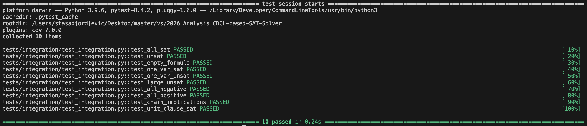
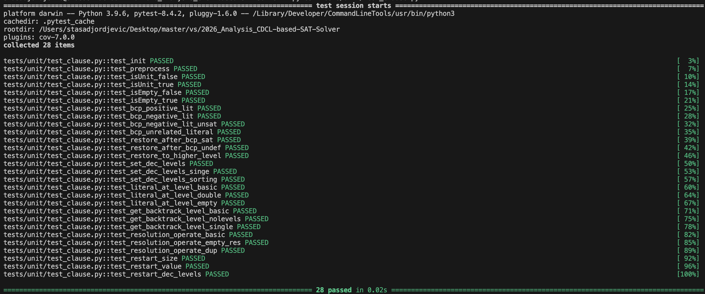
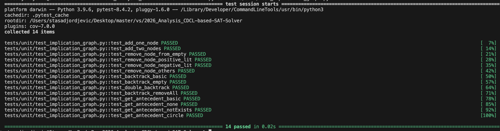
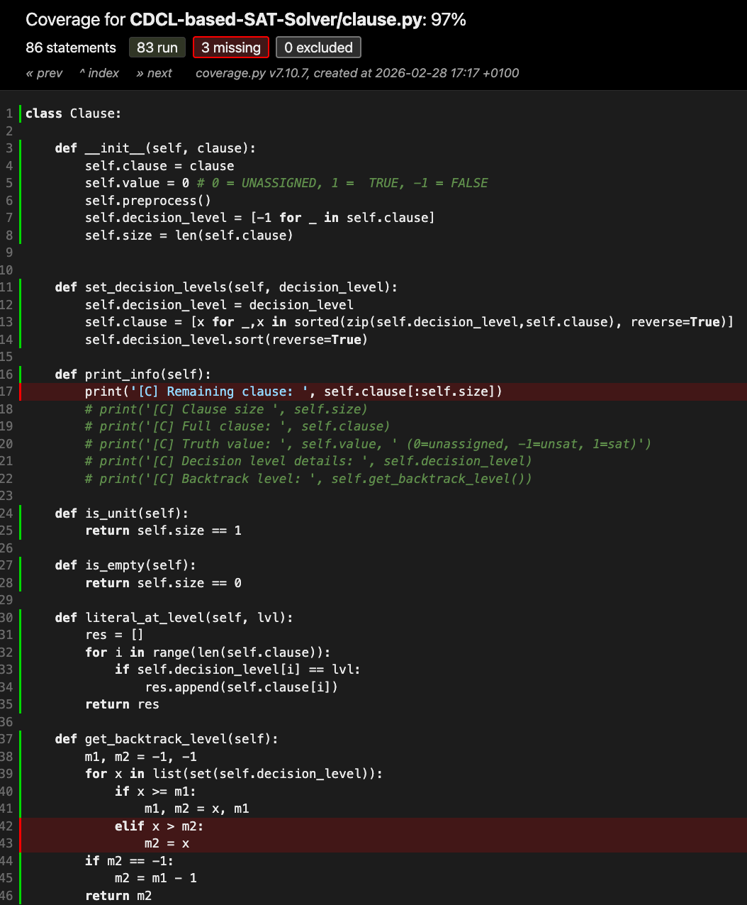
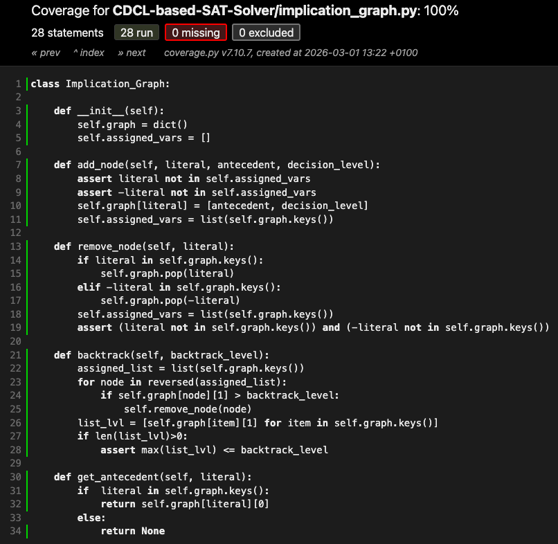
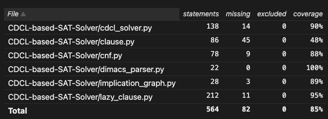
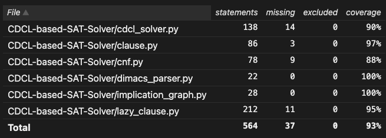
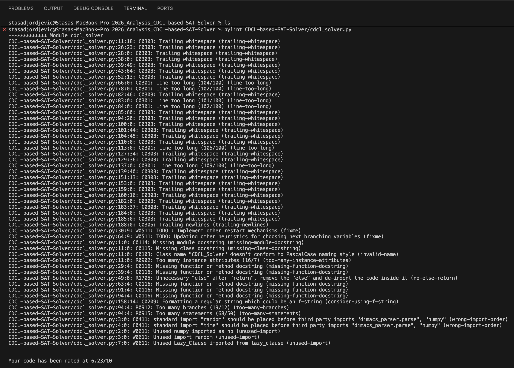
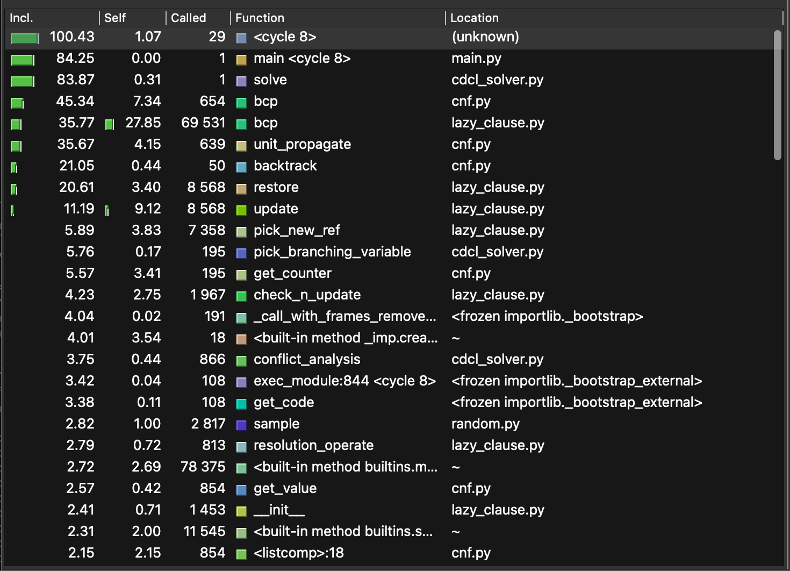
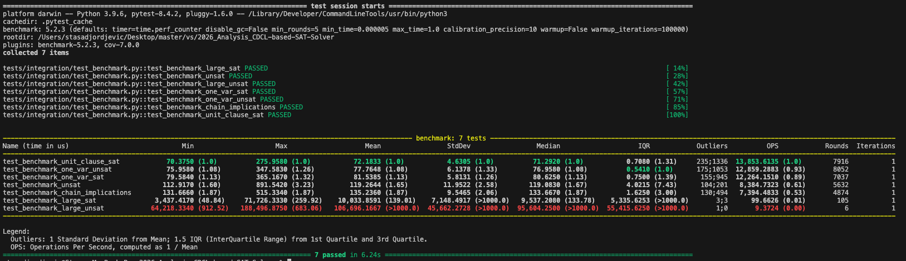

# Analiza CDCL-based SAT Solver-a

Sprovodi se analiza projekta koji je napisan u Python-u za rešavanje SAT problema koristeći CDCL algoritam.

Napomena: fajlovi iz originalnog projekta `dpll_solver.py` i `cnf_data_structure.py` se nigde ne koriste - trebalo bi biti obrisani. `dpll_solver.py` ima smisla jer prikazuje jednostavniji ali manje efikasan DPLL algoritam. Fajl `cnf_data_structure.py` je skroz nepotreban (dupliran kod).

Primenjeni su sledeći alati za analizu projekta:
1. Integraciono testiranje - pytest
2. Jedinično testiranje - pytest
3. Pokrivenost koda - Coverage.py
4. Statička analiza - Pylint
5. Analiza složenosti - Radon
6. Profajliranje - cProfile i pyprof2calltree
7. Merenje performansi - pytest-benchmark
8. Formatiranje koda - Black

## Integraciono testiranje - pytest

Za proveru ispravnosti rešavača sprovedeno je integraciono testiranje.  
Testovi su smešteni u folderu `tests/integration` i sadrže formule u DIMACS CNF formatu.  
Svaki test proverava da li je data formula zadovoljiva (SAT) ili nezadovoljiva (UNSAT).  

Test primeri u folderu `/all_sat` preuzeti su sa sajta:  
https://www.cs.ubc.ca/~hoos/SATLIB/benchm.html
Test primer `large_unsat.cnf` preuzet je sa sajta: https://people.sc.fsu.edu/~jburkardt/data/cnf/aim-100-1_6-no-1.cnf

Integracionim testovima pokriveni su sledeći slučajevi:
- Obične zadovoljive formule (SAT)
- Obične nezadovoljive formule (UNSAT)
- Velike zadovoljive formule
- Velike nezadovoljive formule
- Specijalni slučajevi:
  - Prazna formula
  - Formula sa jednom promenljivom
  - Formula gde su sve klauze jedinicne i pozitivne
  - Formula gde su sve klauze jedinicne i negativne
  - Lanac implikacija

Pokretanje integracionih testova vrši se pomoću skripte `test_integration.py`, koja prolazi kroz sve test fajlove i pokreće rešavač nad njima.

Nakon pokretanja testova komandom:
```bash
pytest tests/integration/test_integration.py -v
```
(opcija -v da bi ispis bio detaljniji)

dobija se sledeći izlaz:


Svih 10 testova je uspešno prošlo za 0.24 sekunde.

## Jedinično testiranje - pytest

Jedinično testiranje ima za cilj proveru ispravnosti pojedinačnih komponenti rešavača izolovano od ostatka sistema.  
Ovaj tip testiranja omogućava rano otkrivanje grešaka i olakšava održavanje i dalji razvoj koda.

Testovi su smešteni u folderu `tests/unit` i organizovani po klasama koje testiraju.

### Pokrivene komponente

#### Klasa `Clause`

Klasa `Clause` predstavlja jednu logičku klauzu u CNF formuli i sadrži najkritičniju logiku za rad rešavača. Testovima su pokriveni sledeći aspekti:

- Inicijalizacija klauze i otkrivanje tautologija u fazi preprocesiranja (`preprocess`)
- Provera stanja klauze - da li je jedinična (`is_unit`) ili prazna (`is_empty`)
- Boolean Constraint Propagation (`bcp`) - zadovoljavanje i falsifikovanje literala,
  kao i detekcija konflikta kada klauza ostane bez aktivnih literala
- Vraćanje klauze na prethodno stanje tokom backtrackinga (`restore`)
- Postavljanje nivoa odluke i sortiranje literala (`set_decision_levels`)
- Dohvatanje literala dodeljenih na zadatom nivou odluke (`literal_at_level`)
- Izračunavanje nivoa na koji treba da se vrati pretraga (`get_backtrack_level`)
- Operacija rezolucije dve klauze po zadatom literalu (`resolution_operate`)
- Potpuno restartovanje klauze na početno stanje (`restart`)

Tokom testiranja uočena je jedna nepravilnost - prilikom preprocesiranja, ukoliko je u pitanju tautologična klauza, vrednost se postavljana 1 (tačno) i veličina na 0. Međutim, u konstruktoru se veličina postavlja na dužinu niza klauze nakon poziva funkcije preprocess, i time se "obriše" to što je prilikom preprocesiranja postavljena na 0.

Nakon pokretanja testova komandom:
```bash
pytest tests/unit/test_clause.py -v
```

dobija se sledeći izlaz:



Svih 28 testova je uspešno prošlo za 0.02 sekunde.

### Klasa `Implication_Graph`
Klasa `Implication_Graph` predstavlja graf implikacija koji se gradi tokom pretrage i koristi se za analizu konflikata i backtracking u CDCL algoritmu. Za svaki dodeljeni literal pamti se antecedent (klauza koja je uzrokovala dodelu) i nivo odluke na kom je literal dodeljen.

Testovima su pokriveni sledeći aspekti:

- Dodavanje jednog i više čvorova u graf (`add_node`) i provera ispravnosti upisanih podataka
- Uklanjanje čvorova pozitivnim i negativnim oblikom literala (`remove_node`), kao i pokušaj uklanjanja nepostojećeg čvora
- Provera da uklanjanje jednog čvora ne utiče na ostale čvorove u grafu
- Backtracking na zadati nivo odluke (`backtrack`) - uklanjanje svih literala dodeljenih na višem nivou, uz zadržavanje onih na nižem
- Backtracking nad praznim grafom i višestruki backtracking
- Dohvatanje prethodnika postojećeg i nepostojećeg literala (`get_antecedent`), uključujući slučaj kružnih referenci između čvorova

Nakon pokretanja testova komandom:
```bash
pytest tests/unit/test_implication_graph.py -v
```

dobija se sledeći izlaz:



Svih 14 testova je uspešno prošlo za 0.02 sekunde.

## Pokrivenost koda - Coverage.py
Pokrivenost koda testovima merena je alatom **Coverage.py**, koji prati (po defaultu) koje linije koda su izvršene tokom testiranja.

### Pokrivenost klase `Clause`
Pokrivenost fajla `clause.py` jediničnim testovima merena je komandom:
```bash
pytest tests/unit/test_clause.py --cov=clause --cov-report=html
```



Ukupna pokrivenost iznosi **97%**. Nepokrivene linije su:

- `elif x > m2` grana u metodi `get_backtrack_level` - analizom koda utvrđeno je da je ova grana nedostižna jer Python iterira nad `set` kolekcijom u rastućem redosledu za cele brojeve, pa svaki naredni element uvek zadovoljava uslov `x >= m1`, a nikad samo `x > m2`.
- `print` naredba u metodi `print_info` - ova metoda služi isključivo za debagovanje i nije pozivana u testovima jer njen izlaz nije deo funkcionalnosti koja se testira.

### Pokrivenost klase `Implication_Graph`

Pokrivenost fajla `implication_graph.py` jediničnim testovima merena je komandom:
```bash
pytest tests/unit/test_implication_graph.py --cov=implication_graph --cov-report=html
```




Ukupna pokrivenost iznosi **100%** - sve linije koda klase `Implication_Graph` su pokrivene jediničnim testovima.


### Pokrivenost integracionih testova

Pokrivenost koda integracionim testovima merena je komandom:
```bash
pytest tests/integration/test_integration.py --cov=cdcl_solver --cov=clause --cov=cnf --cov=dimacs_parser --cov=implication_graph --cov=lazy_clause  --cov-report=html
```
Za razliku od jediničnih testova koji mere pokrivenost pojedinačnih klasa, integracioni testovi pokreću ceo rešavač, pa ima smisla meriti pokrivenost svih fajlova projekta zajedno. Merenje je ograničeno na fajlove koji su deo aktivne implementacije - fajlovi `dpll_solver.py` i `cnf_data_structure.py` su izostavljeni jer se nigde ne koriste, a `utils.py` jer samo učitava argumente komandne linije i nije deo same logike rešavanja.



Ukupna pokrivenost iznosi **85%**. Najniža pokrivenost je kod `clause.py` sa svega 48%. Pokrivenost ostalih komponenti je prilično visoka.

### Ukupna pokrivenost

Pokrivenost merena svim testovima zajedno (jediničnim i integracionim):
```bash
pytest tests/ --cov=cdcl_solver --cov=clause --cov=cnf --cov=dimacs_parser --cov=implication_graph --cov=lazy_clause --cov-report=html
```



Ukupna pokrivenost iznosi **93%**. Kombinovanjem jediničnih i integracionih testova pokrivenost `clause.py` je porasla sa 48% na 97%, što potvrđuje da se jedinični i integracioni testovi međusobno dopunjuju.

Ukupna pokrivenost od 93% predstavlja odličan rezultat i ukazuje da testovi dobro pokrivaju funkcionalnost projekta.

## Statička analiza - Pylint
Pylint je alat za statičku analizu Python koda koji proverava stil, kvalitet i potencijalne greške bez pokretanja programa.  Može se instalirati komandom:
```bash
pip install pylint
```

Analiza je sprovedena nad glavnim fajlom rešavača `cdcl_solver.py`, a ukupna ocena iznosi **6.23/10**.

### Kategorije pronađenih problema

Pylint klasifikuje probleme prema prefiksu u oznaci:
- **F** (Fatal) - fatalna greška koja je sprečila Pylint da nastavi analizu
- **E** (Error) - greške koje verovatno uzrokuju probleme pri izvršavanju
- **W** (Warning) - upozorenja na potencijalne greške
- **C** (Convention) - kršenje konvencija stila pisanja koda
- **R** (Refactor) - predlozi za poboljšanje strukture koda

Komanda za pokretanje:
```bash
pylint CDCL-based-SAT-Solver/cdcl_solver.py
```
izlaz:



Opisi problema su prilično informativni tako da se može lako razumeti gde je nastao koji problem.
### Pronađeni problemi

**Stilski problemi (C)** su najbrojniji. Dominiraju `trailing-whitespace` upozorenja - višak belina na kraju linija koda, kao i nekoliko `line-too-long` upozorenja gde linije prelaze dozvoljenih 100 karaktera. Pored toga, nedostaju docstringovi (tekstualni opisi) za modul, klasu i sve metode (`missing-module-docstring`, `missing-class-docstring`, `missing-function-docstring`). Takođe je uočen pogrešan redosled importa - standardne biblioteke (`random`, `time`) treba da budu importovane pre biblioteka trećih strana.

**Upozorenja (W)** ukazuju na tri nekorišćena importa: `numpy`, `random` i `Lazy_Clause` su importovani ali se nigde ne koriste u fajlu. Prisutna su i dva `fixme` upozorenja koja odgovaraju TODO komentarima u kodu - njihovo prisustvo u finalnoj verziji koda nije poželjno jer ukazuje na nedovršenu implementaciju i može zbuniti buduće čitaoce koda.

**Predlozi za refaktorisanje (R)** ukazuju na strukturne probleme: klasa `CDCL_Solver` ima previše atributa (16, dok je preporučeno maksimalno 7), glavna metoda rešavača ima previše grana (19) i previše naredbi (68), što ukazuje na visoku složenost koja otežava čitanje i testiranje. Takođe je uočen `no-else-return` - nepotrebna `else` grana nakon `return` naredbe.

**Imenovanje** - ime klase `CDCL_Solver` ne prati Python konvenciju PascalCase (trebalo bi biti `CDCLSolver` ili `CdclSolver`).

### Zaključak

Većina pronađenih problema su stilske prirode i ne utiču na ispravnost programa. 
Međutim, upozorenja o nekorišćenim importima i previsokoj složenosti glavne metode rešavača su vredni pažnje - nekorišćeni importi povećavaju nepotrebne zavisnosti, a visoka složenost glavne metode direktno otežava testiranje i održavanje.


## Analiza složenosti koda - Radon

Radon je Python alat koji izračunava različite metrike koda. Podržane metrike su:

- **Raw metrike** - broj linija izvornog koda, linija komentara i praznih linija
- **Ciklomatska složenost** - meri broj nezavisnih putanja kroz kod
- **Halstead metrike** - mere složenost na osnovu operatora i operanada u kodu
- **Maintainability Index** - metrika koja ocenjuje održivost koda vrednošću od 0 do 100

Može se instalirati komandom:
```bash
pip install radon
```

Radon ima više opcija, od kojih svaka meri drugačiju metriku:
- `raw` - raw metrike
- `cc` - ciklomatska složenost
- `hal` - Halstead metrike
- `mi` - Maintainability Index

Opšti oblik komande je:
```bash
radon [opcija] folder [-a] [-s]
```
gde `-a` prikazuje prosečnu složenost na kraju, a `-s` prikazuje ocenu (A, B, C...) uz svaki blok.

### Ciklomatska složenost

Ciklomatska složenost meri broj nezavisnih putanja kroz kod - što je veći broj, kod je teže testirati i održavati.

Analiza je sprovedena nad svim fajlovima projekta komandom:
```bash
radon cc ./CDCL-based-SAT-Solver -a -s > radon_output.txt
```
Detaljan izveštaj sa složenošću svake metode i klase sačuvan je u fajlu `radon_output.txt`.

Ukupno je analizirano 103 bloka (klase, funkcije i metode), a prosečna složenost iznosi **B (5.62)**, što je generalno prihvatljivo. Međutim, izdvajaju se dva kritična slučaja:

- `CDCL_Solver.solve` u `cdcl_solver.py` dobila je ocenu **E (35)** - ovo je glavna metoda rešavača koja implementira celokupan CDCL algoritam i sadrži veliki broj grananja, što je u skladu sa Pylint nalazom o previše grana i naredbi u istoj metodi.

- `Lazy_Clause.bcp` u `lazy_clause.py` dobila je ocenu **D (29)**. Ova metoda ima tri glavne grane u zavisnosti od veličine klauze, sa dodatnim grananjem unutar svake. Ista metoda postoji i u fajlu `cnf_data_structure.py` (ocena **E (31)**), ali se taj fajl ne koristi u projektu.

Ostatak koda je većinom ocenjen ocenama A i B, što ukazuje da su ostale komponente projekta dobro strukturirane. Visoka složenost je koncentrisana u metodama koje implementiraju centralnu logiku algoritma, što je delimično očekivano s obzirom na prirodu CDCL algoritma.

## Profajliranje - cProfile
cProfile je ugrađeni Python alat za profajliranje koji meri vreme izvršavanja i broj poziva svake funkcije.

### Pokretanje

Profajliranje je sprovedeno nad većim UNSAT primerom (`large_unsat.cnf`) sa 100 promenljivih i 160 klauza, koji dobro oslikava rad programa jer rešavač mora da istraži veći prostor pretrage pre nego što zaključi da formula nema rešenje.

Izlaz je sačuvan u `.prof` fajl komandom:
```bash
python3 -m cProfile -s cumulative -o profileFile.prof ./CDCL-based-SAT-Solver/main.py -i ./tests/integration/large_unsat.cnf
```

gde `-s cumulative` sortira funkcije po ukupnom vremenu izvršavanja, a `-o` čuva izlaz u `.prof` fajl.

### Vizualizacija - pyprof2calltree i KCachegrind

`.prof` fajl je vizualizovan pomoću alata `pyprof2calltree`.

Instalacija:
```bash
pip install pyprof2calltree
# Linux:
sudo apt install kcachegrind
# Mac:
brew install qcachegrind
```

Pokretanje:
```bash
pyprof2calltree -i profileFile.prof -k
```
Opcija `-i` označava ulazni fajl (input) - u ovom slučaju .prof fajl koji je generisao cProfile. Opcija `-k` automatski otvara KCachegrind sa konvertovanim fajlom.
### Rezultati

Funkcije projekta sortirane po ukupnom vremenu izvršavanja:



Na slici je prikazan flat profile tj. lista funkcija sortiranih po ukupnom vremenu izvršavanja (`Incl.`). Kolona `Incl.` predstavlja ukupno vreme koje funkcija troši uključujući sve funkcije koje ona poziva, dok kolona `Self` prikazuje vreme koje funkcija troši isključivo na sopstveni kod, bez poziva podfunkcija. Kolona `Called` prikazuje broj puta koliko je funkcija pozvana tokom izvršavanja.

Na vrhu liste nalazi se `<cycle 8>` koji nije deo stvarne logike programa i može se ignorisati. Odmah ispod je `main.py` što je i očekivano jer ona poziva sve ostale funkcije. Zatim `cdcl_solver.solve` koja dominira stvarnim vremenom rada programa. Dalje slede `cnf.bcp` i 
`lazy_clause.bcp` kao najzastupljenije funkcije po broju poziva i vremenu, što potvrđuje da je BCP centralna operacija u CDCL algoritmu.

Posebno je interesantno da `lazy_clause.bcp` ima visoku vrednost i u `Self` koloni (27.85%), što znači da funkcija troši značajno vreme na sopstveni kod, a ne samo na podfunkcije koje poziva. Ovo je u skladu sa Radon analizom koja je ovu metodu ocenila visokom složenošću (ocena D, vrednost 29) - složena logika sa mnogo grananja direktno se odražava na vreme izvršavanja.

S obzirom na to da `lazy_clause.bcp` troši značajan deo ukupnog vremena izvršavanja i poziva se mnogo puta, svako poboljšanje efikasnosti ove funkcije direktno bi se odrazilo na performanse celog programa.


## Merenje performansi - pytest-benchmark

pytest-benchmark je plugin za pytest koji meri vreme izvršavanja testova i generiše detaljne statistike. 

Instalacija:
```bash
pip install pytest-benchmark
```

Za razliku od običnih testova koji samo proveravaju ispravnost rezultata, benchmark testovi pokreću svaku funkciju više puta i mere statistike vremena izvršavanja. Na osnovu toga se može zaključiti koliko je rešavač efikasan na različitim ulazima. Nisu pokriveni svi slučajevi kao u integracionim testovima - izostavljeni su trivijalni primeri kod kojih merenje performansi nije informativno. Takođe, umesto iteriranja kroz sve fajlove iz foldera `all_sat`, uzet je samo jedan reprezentativni primer (`large_sat`) jer su svi primeri u tom folderu slične veličine.

Pokretanje:
```bash
pytest tests/integration/test_benchmark.py -v
```

### Rezultati


Vremena su izražena u mikrosekundama (us), što je naznačeno u zaglavlju tabele. 
Kolone označavaju redom: minimalno, maksimalno i srednje vreme izvršavanja, standardnu devijaciju, medijanu, interkvartilni raspon, broj outlier-a, broj operacija u sekundi, broj pokretanja i broj iteracija po pokretanju.

Rezultati pokazuju jasnu korelaciju između veličine ulaza i vremena rešavanja. 
Jednostavni primeri završavaju za oko 70-135 mikrosekundi. `large_sat` (20 promenljivih, 91 klauza) traje u proseku **10ms**, a `large_unsat` (100 promenljivih, 160 klauza) čak **107ms**. Duže vreme izvršavanja `large_unsat` primera posledica je i veće formule i same prirode UNSAT problema - rešavač mora da istraži ceo prostor pretrage pre nego što donese zaključak, za razliku od SAT primera gde pronalazi rešenje čim naiđe na zadovoljavajuću valuaciju.

Visoka standardna devijacija kod oba velika primera ukazuje na nedeterministično ponašanje rešavača, što je posledica nasumičnog odabira referentnih literala (`refA` i `refB`) u klasi `Lazy_Clause`. Različiti odabiri referenci tokom pretrage mogu dovesti do veoma različitih putanja kroz prostor rešenja, pa samim tim i do različitih vremena izvršavanja.

## Formatiranje koda - Black
Za automatsko formatiranje koda korišćen je alat Black, koji primenjuje konzistentno stilizovanje koda na svim fajlovima projekta.

Može se instalirati komandom:
```bash
pip install black
```

Da bi se izbeglo direktno menjanje originalnog koda, formatiranje je sprovedeno nad privremenom kopijom projekta. Skripta kopira projekat, pokreće black nad kopijom i generiše `.patch` fajl sa svim promenama:

```bash
#!/bin/bash
cp -r ./CDCL-based-SAT-Solver /tmp/CDCL-based-SAT-Solver_formatted
black /tmp/CDCL-based-SAT-Solver_formatted

diff -ru ./CDCL-based-SAT-Solver /tmp/CDCL-based-SAT-Solver_formatted > patches/formatting.patch
rm -rf /tmp/CDCL-based-SAT-Solver_formatted
```

Rezultat je sačuvan u fajlu `patches/formatting.patch`.

**Black** primenjuje:

- Konzistentno formatiranje linija prema PEP 8 standardu
- Prelamanje predugih linija
- Standardizaciju belina, uvlačenja i znakova navoda
- Uklanjanje viška praznih linija i `trailing-whitespace`

Ove izmene direktno rešavaju većinu Pylint upozorenja iz kategorije **C - Convention**, koja se odnose na stil i formatiranje koda.